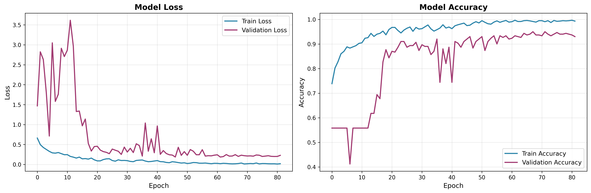
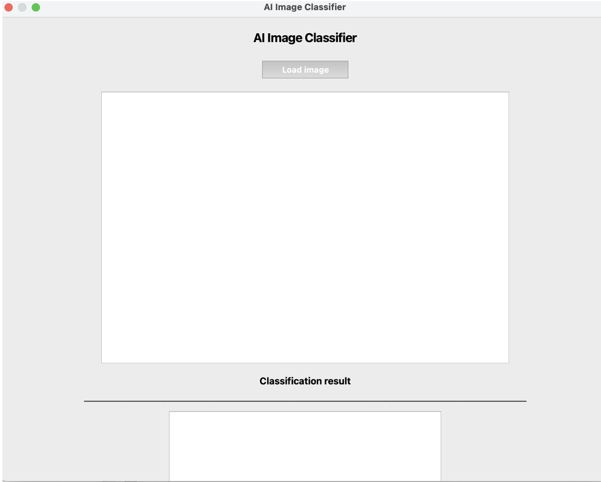
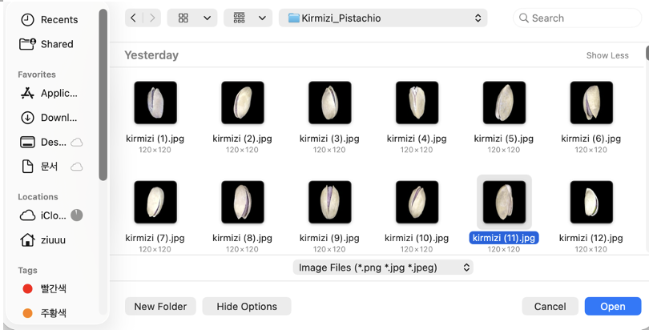
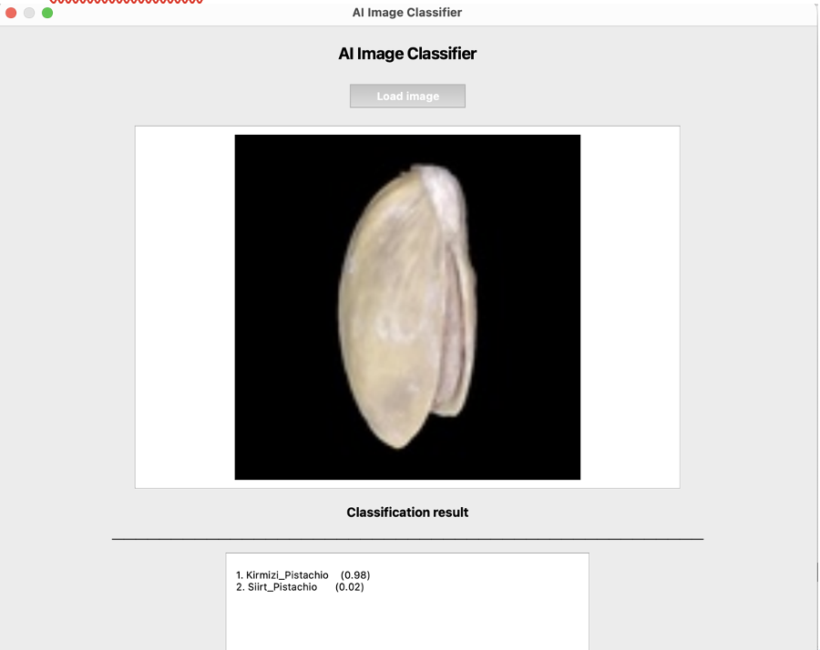
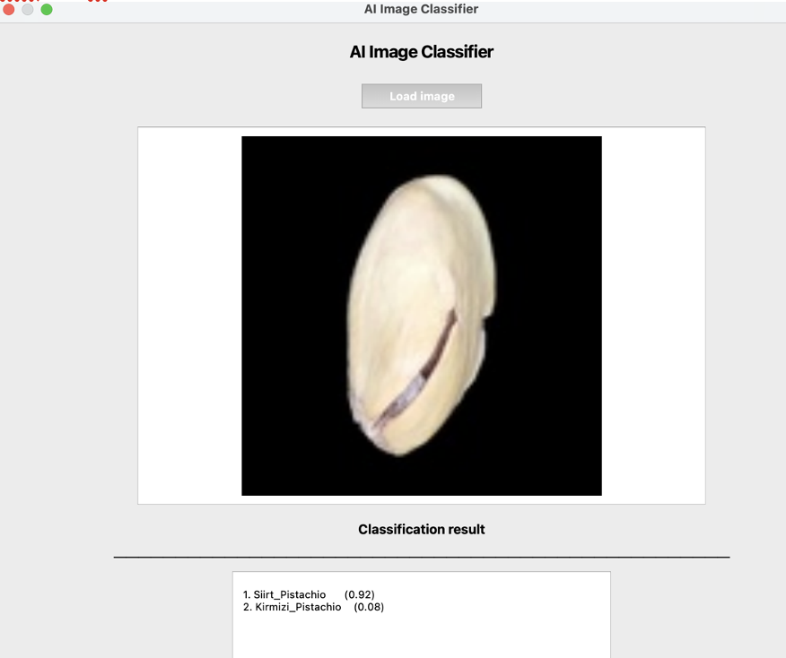

# 피스타치오 분류 CNN 모델

Kirmizi 피스타치오와 Siirt 피스타치오를 분류하는 딥러닝 모델

## 📋 프로젝트 개요

- **목적**: Kirmizi vs Siirt 피스타치오 이진 분류
- **데이터**: 2,148개 이미지 (120x120x3)
- **모델**: VGG 스타일 CNN (전이학습 사용 안 함)
- **최종 성능**: Test Accuracy 94.42%, Overfitting 4.12%

## 🏗️ 모델 아키텍처

- **구조**: 4개 Convolutional Blocks + 2개 Fully Connected Layers
- **필터 수**: 32 → 64 → 128 → 256 (점진적 증가)
- **정규화**: BatchNormalization + Dropout (Conv 0.3, Dense 0.6)
- **총 파라미터**: 7,667,489개

## 📊 성능

| 지표 | 값 |
|------|-----|
| Train Accuracy | 98.54% |
| Test Accuracy | 94.42% |
| Overfitting | 4.12% |
| Kirmizi 정확도 | 92.70% |
| Siirt 정확도 | 96.73% |

## 🚀 사용 방법

### 1. 환경 설정

```bash
pip install tensorflow keras pillow scikit-learn matplotlib pyqt5
```

### 2. 학습 실행

```bash
python part1_final.py
```

생성 파일:
- `pistachio_model_final.h5` - 학습된 모델
- `learning_curves.png` - 학습 곡선 그래프
- `part1_final_report.txt` - 상세 보고서

### 3. GUI 실행

```bash
python part2_gui.py
```

## 📁 파일 구조

```
Pistachio/
├── part1_final.py              # 모델 학습 코드
├── part2_gui.py                # GUI 애플리케이션
├── resize_images.py            # 이미지 전처리
├── learning_curves.png         # 학습 곡선
├── part1_final_report.txt      # 성능 보고서
└── README.md
```

## 🔧 주요 최적화 기법

1. **VGG 아키텍처 커스터마이징**: 데이터셋 크기에 맞게 조정
2. **Dropout 비율 조정**: Conv(0.3), Dense(0.6)로 과적합 4.12%로 감소
3. **Learning Rate Scheduling**: ReduceLROnPlateau 적용
4. **EarlyStopping**: Epoch 68에서 최적 성능 포착
5. **Stratified Split**: 클래스 비율 유지하며 데이터 분할

## 📈 학습 결과



## 🖥️ GUI 실행 화면

### 초기 화면


### 이미지 선택


### 분류 결과

**Kirmizi 피스타치오 분류 예시**:


- Kirmizi_Pistachio: 98% 확률
- Siirt_Pistachio: 2% 확률

**Siirt 피스타치오 분류 예시**:


- Siirt_Pistachio: 96% 확률
- Kirmizi_Pistachio: 4% 확률

## 🎯 특징

- ✅ 전이학습 없이 처음부터 학습
- ✅ 과적합 최소화 (4.12%)
- ✅ 균형잡힌 클래스별 성능
- ✅ 실시간 GUI 분류 애플리케이션

## 📝 라이센스

MIT License

## 👥 개발자

DKU Deep Learning Team
